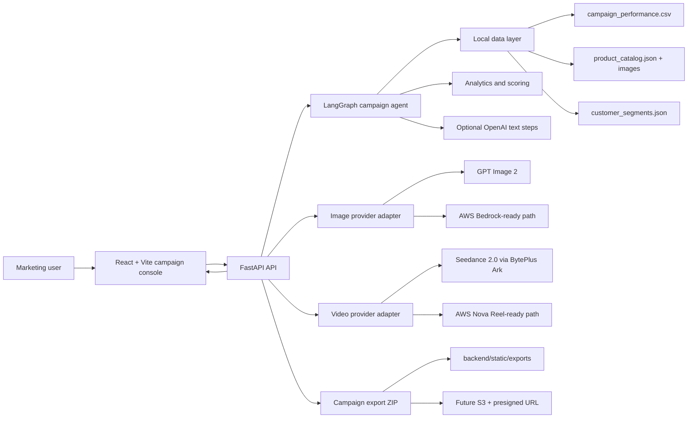

# Architecture Overview

## Purpose

The Retail Ad Studio prototype shows how a Southeast Asia fashion retailer can move from a slow agency-led creative cycle to a data-informed launch workflow. A marketer reviews a recommendation, edits a brief, generates ranked platform previews, creates selected media assets, and exports a handoff package.

## System Diagram

## Runtime Components

- **React + Vite frontend**: interactive campaign console for recommendations, brief controls, ranked previews, generated media, and export status.
- **FastAPI backend**: API layer for bootstrap data, generation, AI refreshes, media generation, static files, health checks, and export packaging.
- **LangGraph agent**: deterministic workflow that loads context, analyzes performance, recommends a strategy, generates creatives, and scores variants.
- **Analytics layer**: computes CTR, CVR, ROAS, CPA, performance patterns, catalog readiness, segment fit, and projected impact.
- **Provider adapters**: keep image/video generation behind backend interfaces so OpenAI, Seedance, Bedrock, or Nova Reel paths can be swapped without changing the UI.
- **Export service**: writes a local ZIP containing manifest, variants CSV, catalog assets, generated media, and AWS handoff notes.

## Data Flow

1. The frontend requests bootstrap data and renders the current campaign brief.
2. The marketer applies a recommendation, edits the brief, or asks the brief assistant to structure a note.
3. FastAPI sends the brief to the LangGraph agent.
4. The agent loads local campaign, product, and segment data; analyzes performance; creates channel-specific variants; and ranks them by projected impact.
5. Optional AI actions refine recommendations, brief fields, copy, selected images, or a selected TikTok video.
6. The export endpoint packages the selected campaign state and generated assets for download.

## AWS Mapping

| Prototype today | AWS-ready target |
| --- | --- |
| Local CSV campaign data | Amazon S3 + AWS Glue Data Catalog |
| Local product and segment JSON | DynamoDB or Aurora PostgreSQL |
| Local product and generated assets | Amazon S3 + CloudFront |
| FastAPI process | AWS App Runner, ECS Fargate, or Lambda container |
| React dev/static build | S3 + CloudFront or AWS Amplify Hosting |
| Local ZIP exports | S3 object + DynamoDB/Aurora metadata + presigned URL |
| Optional OpenAI/GPT Image 2 calls | Secrets Manager plus approved OpenAI or Bedrock model layer |
| Seedance/cached video path | AWS Nova Reel async generation to S3, or approved external provider |
| On-demand insight refresh | EventBridge + Step Functions or scheduled ECS task |

## Why This Architecture

The build keeps the demo small, portable, and low-cost while preserving production boundaries: UI, API, agent orchestration, analytics, provider adapters, and export storage are separate. Those boundaries let the prototype run locally today and migrate toward AWS-managed data, media, model, and hosting services with limited workflow changes.
